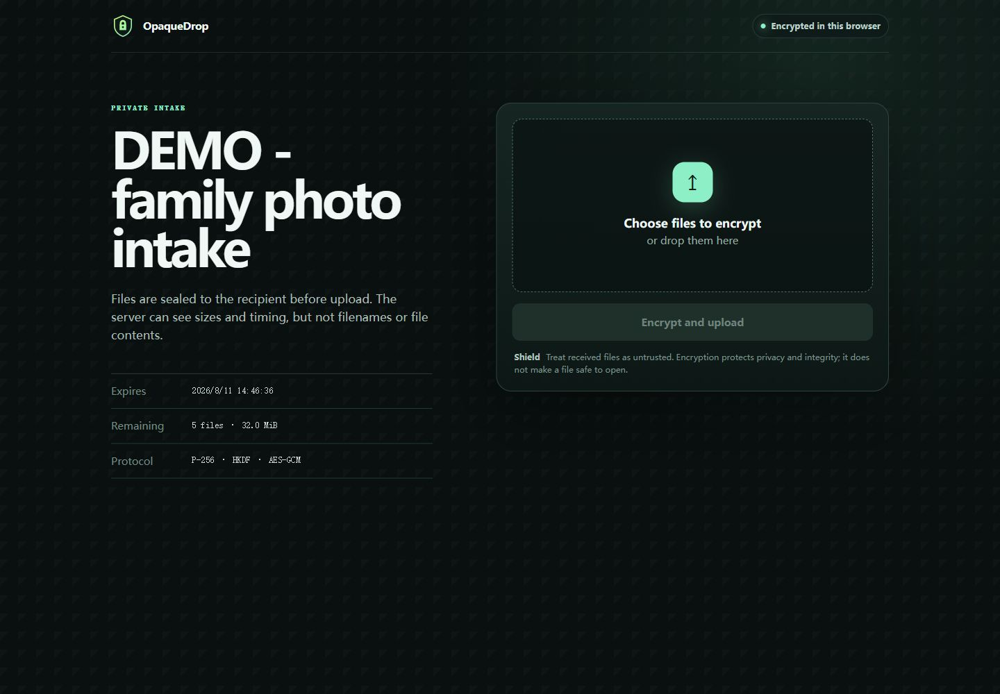
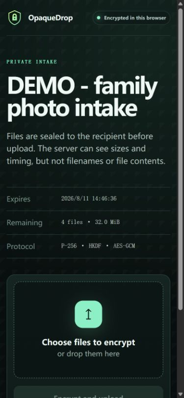
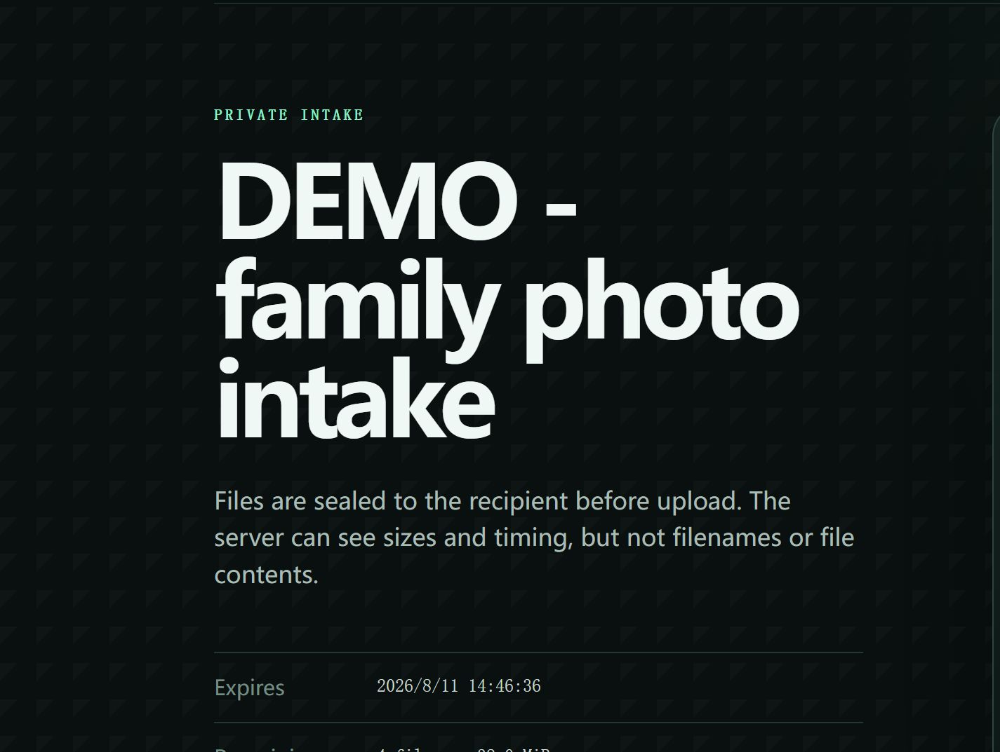

<div align="center">
  
  <h1>OpaqueDrop</h1>
  <p><strong>Accountless inbound file requests where the self-hosted server stores ciphertext, not file contents.</strong></p>
  <p>
    <a href="https://github.com/CAOShurong/opaquedrop/actions/workflows/ci.yml"></a>
    <a href="https://github.com/CAOShurong/opaquedrop/releases"></a>
    <a href="LICENSE"></a>
    
  </p>
</div>

<p align="center">
  
  
</p>

OpaqueDrop is a narrow self-hosted intake service. A recipient creates a request and shares one browser link. The uploader needs no account or app. The browser encrypts each file—including its filename and MIME metadata—to a recipient-held P-256 key before sending constant-size chunks. The server receives only ciphertext, request limits, sizes, and timestamps.

This is deliberately not a file manager, sync suite, generic sharing portal, or malware scanner.

## Why this exists

Maintained tools already cover ordinary file drops well. Copyparty offers portable write-only uploads; Nextcloud provides anonymous File Drop; Gokapi is a strong single-binary sharing service. The remaining gap is narrower: **Gokapi's own documentation says File Requests bypass its Level 3 end-to-end encryption**, while Nextcloud and Copyparty write uploads in server-readable form. Commercial products such as Tresorit provide end-to-end encrypted file requests, but are not self-hosted.

OpaqueDrop isolates that one workflow with no database, container runtime, account system, JavaScript framework, or runtime dependency. See the [evidence and alternatives analysis](docs/RESEARCH.md).

## What the server can and cannot see

| Server can see | Server does not receive |
|---|---|
| Request label and public key | Recipient private key |
| Declared and ciphertext byte counts | Filename or MIME metadata in plaintext |
| Chunk count and upload timestamps | File contents in plaintext |
| Source IP through the network stack or reverse-proxy logs | Raw submit or collect capabilities at rest |

The hosted upload page cannot protect against a server administrator who maliciously changes that page's JavaScript while the uploader is using it. OpaqueDrop protects stored submissions against an honest-but-curious host, later storage disclosure, and server-side applications that never receive the recipient key. It is **not externally audited**. Read the [threat model](docs/THREAT_MODEL.md) before using it for sensitive material.

## Quick start

Download the archive for your platform from [GitHub Releases](https://github.com/CAOShurong/opaquedrop/releases), extract it, then initialize a data directory:

```console
opaquedrop init --data ./opaquedrop-data
```

Create a 24-hour request. For public use, put OpaqueDrop behind HTTPS; plain HTTP is accepted only for localhost.

```console
opaquedrop request create \
  --data ./opaquedrop-data \
  --base-url https://drop.example.net \
  --label "Photos for the family archive" \
  --expires 24h \
  --max-files 20 \
  --max-bytes 8GiB \
  --key-out ./family-photos.key.json \
  --bundle-out ./family-photos.bundle.json
```

Start the service on loopback and let a reverse proxy terminate TLS:

```console
opaquedrop serve --data ./opaquedrop-data --listen 127.0.0.1:8080
```

Share the printed upload link. After files arrive, collect and authenticate them:

```console
opaquedrop collect --key ./family-photos.key.json --out ./received
```

The collector writes each file to a private temporary file, verifies every AES-GCM tag and the ciphertext receipt, syncs it, atomically renames it to a sanitized basename, and only then acknowledges collection.

## Keep the recipient key off the server

`request create` is convenient when the recipient and server owner are the same person. To keep a hosting administrator technically unable to decrypt submissions, split request generation from server import:

```console
# On a recipient-controlled device
opaquedrop request make \
  --base-url https://drop.example.net \
  --label "Documents for Alice" \
  --bundle-out alice.bundle.json \
  --key-out alice.key.json

# Copy only alice.bundle.json to the server
opaquedrop request import --data ./opaquedrop-data --bundle alice.bundle.json
```

The public bundle contains a P-256 public key and SHA-256 hashes of two independent 256-bit capability tokens. The private key file contains the collect capability and recipient private key. It never needs to touch the server.

## Security properties exercised in CI

- Node.js WebCrypto and Go decrypt the same fixed cross-implementation vector.
- Each upload derives a fresh AES-256 key with ECDH P-256 and HKDF-SHA256.
- An 8-byte random nonce prefix plus a big-endian chunk counter makes every nonce unique under that file key; `0xffffffff` is reserved for encrypted metadata.
- A SHA-256 header binding is authenticated as AES-GCM associated data for metadata and every chunk.
- Corrupted, reordered, and missing chunks fail without a completed output file.
- Manifest bodies are limited to 64 KiB; ciphertext chunks are limited to 8 MiB; the shipped browser uses 1 MiB chunks.
- Request file and byte quotas count incomplete reservations, closing the obvious concurrent-overcommit path.
- Capability tokens arrive only in an `Authorization` header, are stored only as hashes, and are not logged.
- Cross-site API requests are rejected; the browser capability starts in the URL fragment, moves to session storage, and is removed from the address bar.
- Server completion markers and collector outputs use same-filesystem atomic rename.
- Request and upload identifiers are allowlisted and reduced to basename components before storage paths are constructed.
- Decrypted names are reduced to a basename, platform-dangerous characters are replaced, collisions are suffixed, and the output directory cannot be a symlink.

These checks are evidence about this implementation, not a substitute for an independent security review. The exact [wire and storage format](docs/PROTOCOL.md) and [committed test vector](testdata/protocol-v1.json) are public.

<details>
<summary>Browser receipt after a completed encrypted upload</summary>



</details>

## Operational commands

```text
opaquedrop init       Create private state directories
opaquedrop request    Make, import, or create a request
opaquedrop serve      Run the HTTP service (loopback by default)
opaquedrop collect    Download, authenticate, decrypt, and acknowledge files
opaquedrop doctor     Check the data directory and storage shape
opaquedrop purge      Preview expired/stale cleanup; --apply performs it
opaquedrop version    Print the build version
```

`purge` is a dry run unless `--apply` is supplied. A request can opt into deleting server ciphertext immediately after a verified collector acknowledgement with `--delete-after-collect`; the default keeps it until expiry cleanup so a recipient can recover from a local mistake.

## Deployment

OpaqueDrop defaults to `127.0.0.1:8080`. Public Web Crypto requires HTTPS. The [deployment guide](docs/DEPLOYMENT.md) includes Caddy, nginx, and systemd examples, backup boundaries, proxy-log cautions, and upgrades. Release archives include one binary plus documentation; no database migration or external service is required.

## Browser support

The upload page uses browser-native ECDH P-256, HKDF-SHA256, and AES-GCM through Web Crypto. It requires a secure context (HTTPS or localhost) and a modern Chromium, Firefox, or Safari browser. Files are processed one 1 MiB chunk at a time; the page does not offer cross-reload resume because the ephemeral file key is intentionally not persisted.

## Contributing and security reports

Small, reviewable changes are welcome. Start with [CONTRIBUTING.md](CONTRIBUTING.md). Do not open public issues for suspected vulnerabilities; follow [SECURITY.md](SECURITY.md).

## License

Apache License 2.0. OpaqueDrop has no third-party runtime dependencies.
